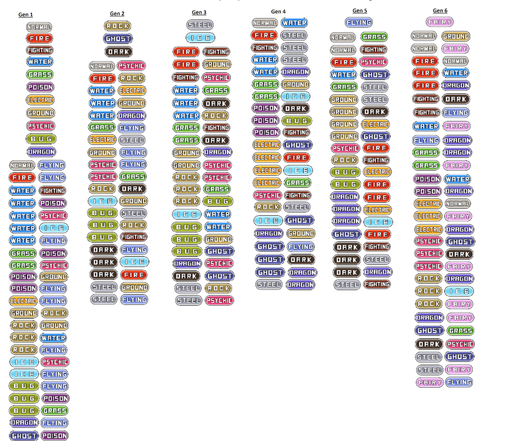

### GROUP MEMBERS
* Miggy Pinaroc
* Cobbie Quintos

# Installation
To install the project locally, a working version of npm must be installed on the machine. npm can be installed with different operating systems [here](https://www.npmjs.com/get-npm).

To install this project and all its dependencies via the terminal/command line:
```
npm install
```
To start running the project on port 3000: 
```
npm start
```
If yarn is installed and preferred: 
```
yarn install
yarn start
```

# Usage

## Project 1
The user may pick between two operations and two algorithms: Tree Generation and Tree Traversal using either DFS or BFS.

For Tree Generation, the user may choose a Pokemon generation (1 or 1,2,3) and the appropriate tree will be created using the selected algorithm.

For Tree Traversal, the user may type in the name of a pokemon, and upon selecting/clicking the algorithm choice, the tree of the pokedex will be traversed by the agent. The visualization of the traversal displays visited nodes in red, and the agent will stop at a matched node, highlighting it in blue. If no such pokemon exists, the whole tree will be visited (red).

As the focus of this project was to visualize the algorithms in action, the front-end has not yet been optimized: responsive design has not yet been implemented, so this project would be best viewed in a full-screen browser.

## Project 2
Upon clicking the "Force Directed Graph" button, the user will be able to search for a start and end pokemon node which will be implemented using Dijkstra's algorithm as a form of informed search. The searched nodes will be displayed in gray, and if successful, the path will be displayed in blue. 

# Why Network Graph over a Tree
We chose to use a network graph rather than a tree because our original data cannot be converted into weighted data. Thus we had to find a dataset that can be given weights, nodes and edges while maintaining the theme of our project.

Using the new dataset, we decided to use a network graph rather than a tree to show how each node is connected with one another. According to geeksforgeeks.org, a tree is commonly used in game trees or decisions trees while graphs are used for finding the shortest path. Since the homework requires us to do informed search, a graph is the best way to represent the shortest path, given the number of options it will show and return the best path to take. A tree on the other hand will show all possible options as well and return the best path but it doesn’t best represent the data.

# Limitations about results and data
Some pokemon do not have a secondary type or some pokemon do not have a combination that exists as shown in the table. Please input pokemon that have existing combinations.



Some results may turn out wrongly due to the data cleaning from python to json
Can try:
Gyarados to Butterfree
Chimchar to Machamp
Psyduck to Groudon
Kyogre to Bayleef


# Online Version
[This project is currently deployed online using Netlify](https://poketree.netlify.com/). 

# Credit

The D3 code used to create the radial tree was written by **Herman Sontrop**. The source code for this could be found [here](https://bl.ocks.org/FrissAnalytics/ffbd3cb71848616957cd4c0f41738aec?fbclid=IwAR2D-Wbmua4TPwmDAtspmYW1z5z5j81tDJBJOPThczmbqJnouLWUjmmfVg8).

We also built upon **Herman Sontrop**'s [idea](https://bl.ocks.org/mph006/7e7d7f629de75ada9af5?fbclid=IwAR1H87O5JykosRT_a3EyajJc41g2kKoVqZgkeJ6Z4wEi62sGiqMt2APNnBM) for using buttons to display the traversals.

